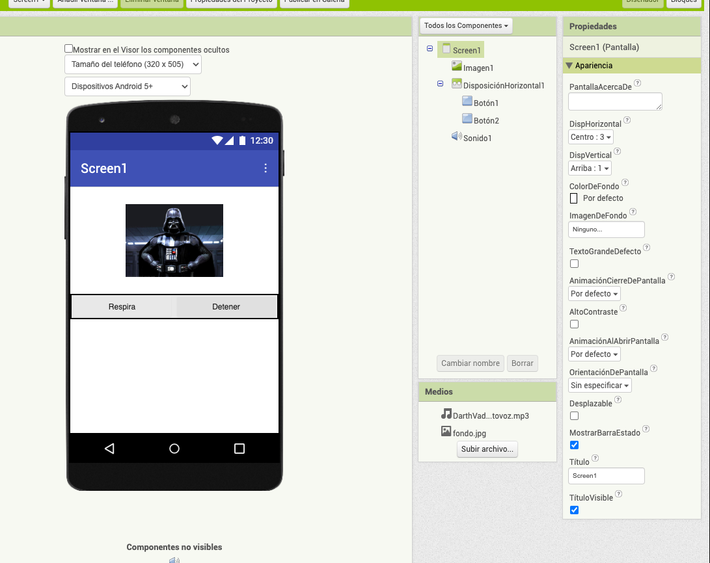

# Practica-1---AppInventor-DarthVader-App
Implementar un programa en AppInventor que:

Diseno

1. Coloque una imagen
2. Dos botones en horizontal, dentro de un mismo contenedor.

sigue la imagen:

Bloques

1. Anadir un bloque que al dar clic en el boton de Reproducir, y se escuchara el audio.
2. Anadir otro que el boton de Pausa, se pare el audio.
